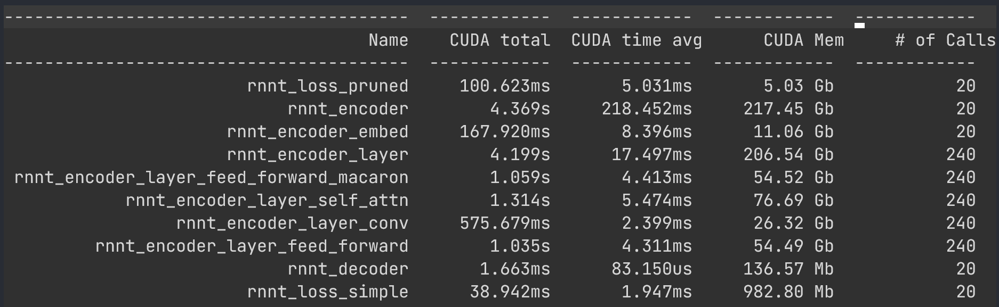
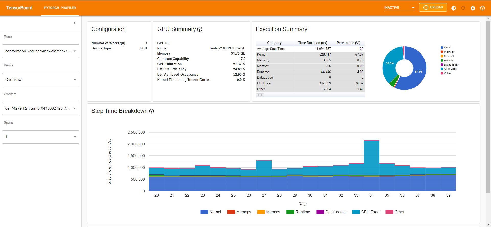
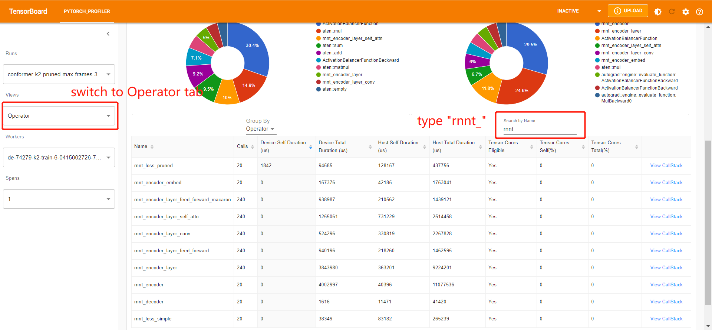

# Introduction
This repo aims to compare relative contribution of different modules of the Conformer model to the training time. It is modified from Kuang Fangjun's repo https://github.com/csukuangfj/transducer-loss-benchmarking. 

The experiments are based on the icefall recipe `pruned_transducer_stateless2` 
(https://github.com/k2-fsa/icefall/tree/master/egs/librispeech/ASR/pruned_transducer_stateless2).

# Environment setup
## Install torchaudio
Please refer to https://github.com/pytorch/audio to install torchaudio. Note: It requires torchaudio >= 0.10.0.
## Install k2
Please refer to https://k2-fsa.github.io/k2/installation/index.html to install k2. Note: It requires at k2 >= v1.13.
## Install PyTorch profiler TensorBoard plugin
```
pip install torch-tb-profiler
```
Please refer to https://github.com/pytorch/kineto/tree/main/tb_plugin for other alternatives.

# Steps to get the benchmark results
## Step 0: Clone the repo
```
git clone git@github.com:yaozengwei/model_profiling.git
```
## Step 1: Generate shape information from training data (Can be skipped)
We get the shape information for input features and targets from the subset train-clean-100 of the LibriSpeech dataset to make the benchmark results more realistic.

We use the script https://github.com/k2-fsa/icefall/blob/master/egs/librispeech/ASR/prepare.sh to prepare the manifest of train-clean-100. This script also produces a BPE model with vocabulary size 500.

The script ./generate_shape_info.py in this repo generates a 2-D tensor, where each row has 2 columns containing information about each utterance in train-clean-100:

Column 0 contains the number of input acoustic frames; Column 1 contains the number of BPE tokens.

Hint: We have saved the generated file ./shape_info.pt in this repo so you don't need to run this step. If you want to do benchmarks on other dataset, you will find ./generate_shape_info.py very handy.

## Step 2: Run model profiling code

You can run the following command and get results in `log/conformer-k2-pruned-max-frames-30000` and `conformer-k2-pruned-max-frames-30000.txt`.
```
python model_profile.py --sort-utterance True
```

Note: We use the following config for model profiling in `model_profile.py`:
```
prof = torch.profiler.profile(
    activities=[ProfilerActivity.CPU, ProfilerActivity.CUDA],
    schedule=torch.profiler.schedule(wait=10, warmup=10, active=20, repeat=2),
    on_trace_ready=torch.profiler.tensorboard_trace_handler(
        f"./log/conformer-k2-pruned-{suffix}"
    ),
    record_shapes=True,
    with_stack=True,
    profile_memory=True,
)
```
In this experiment with wait=10, warmup=10, active=20, repeat=2, pytorch profiler will skip the first 10 iterations, 
start warming up for 10 iterations, record the following 20 iterations. In total, the cycle repeats twice.

We warp the code for each module we want to record in separate labelled context managers using `profiler.record_function("label")`. 
You can modify it manually in the codes such as `model.py` and `conformer.py`. 

The labels we use include
* "rnnt_encoder" -> transducer encoder, i.e., the Conformer model 
* "rnnt_decoder" -> transducer decoder 
* loss computation module containing "rnnt_loss_simple" and "rnnt_loss_pruned" 
* "rnnt_encoder_embed" -> convolutional subsampling layer in encoder
* "rnnt_encoder_layer" -> each ConformerEncoderLayer layer 
* four modules in each ConformerEncoderLayer layer 
  * "rnnt_encoder_layer_feed_forward_macaron" 
  * "rnnt_encoder_layer_self_attn"
  * "rnnt_encoder_layer_conv"
  * "rnnt_encoder_layer_feed_forward"

### Step 3: Visualize Results

The summarized result is in `conformer-k2-pruned-max-frames-30000.txt`. 

You can run the following command to filter out the result we recorded (beginning with "rnnt") and save it to `conformer-k2-pruned-max-frames-30000-filtered.txt`. 

```
head conformer-k2-pruned-max-frames-30000.txt -n 3 > conformer-k2-pruned-max-frames-30000-filtered.txt 
grep -E 'rnnt' conformer-k2-pruned-max-frames-30000.txt >> conformer-k2-pruned-max-frames-30000-filtered.txt
```

The filtered result is as follows, in which some columns are omitted. 


You can use tensorboard to visualize the result. For example, run
```
tensorboard --logdir log/conformer-k2-pruned-max-frames-30000/ --port 16203 
```


You can compare the operations we recorded following the instructions in the figure:

